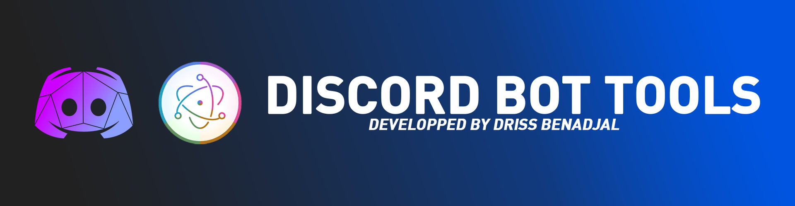

<a href="https://github.com/drissbenadjal"></a>

## Discord Bot Tools

This tool is open source it will allow you to control your bot thanks to a client created with electron.js and discord.js

Current features :
- Change username
- Change game status
- Change status
- Message sender in servers

Download lastVersion of Discord Bot Tools here :

Soon

You can download the project :

```bash
git clone --depth 1 --branch main https://github.com/drissbenadjal/discord-bot-tool-app.git discord-bot-tools
cd discord-bot-tools
npm install
```

## Starting Development

Start the app in the `dev` environment:

```bash
npm start
```

## Maintainers

- [Driss Benadjal](https://github.com/drissbenadjal)
